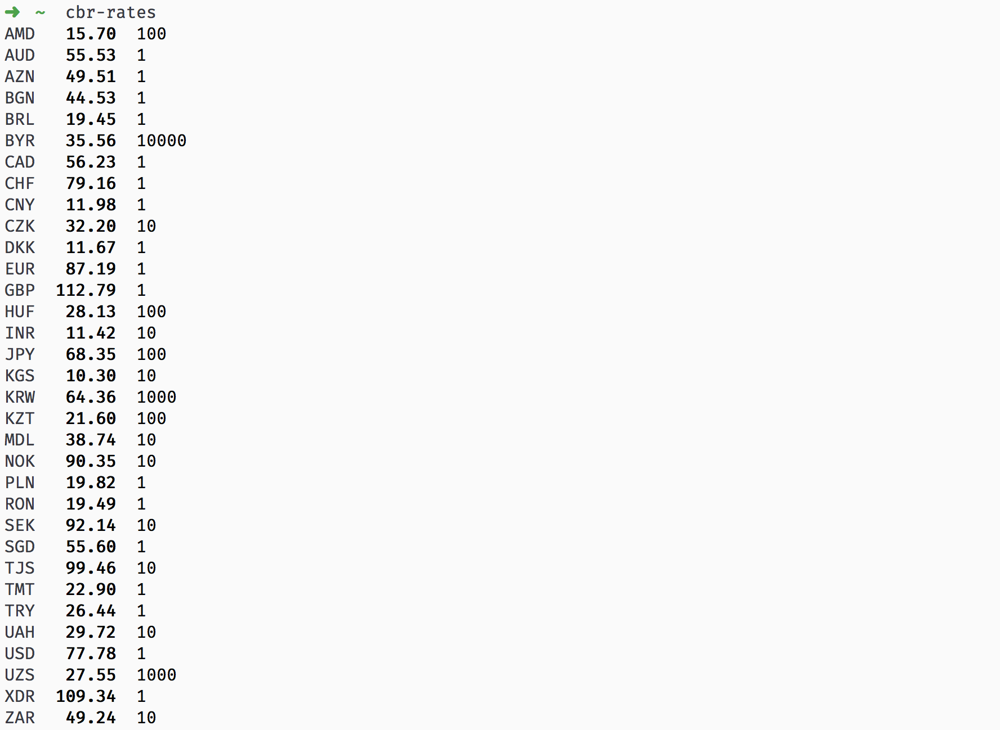

# cbr-rates-cli [![Build Status][travis-image]][travis-url]

> Get currency rates from Central Bank of Russia

[cbr-rates][cbr-rates] - API for this module



## Install

```sh
npm install --global cbr-rates-cli
```

## Usage

```sh
cbr-rates --help

  Usage
    cbr-rates [...id] [date]

  Examples
    cbr-rates
    cbr-rates usd eur
    cbr-rates 2014.5.12
```


## License

MIT

[travis-url]: https://travis-ci.org/andrepolischuk/cbr-rates-cli
[travis-image]: https://travis-ci.org/andrepolischuk/cbr-rates-cli.svg?branch=master

[cbr-rates]: https://github.com/andrepolischuk/cbr-rates
